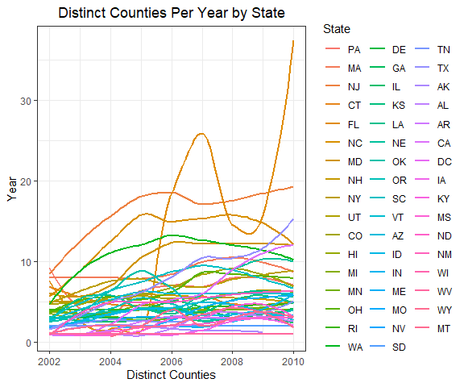
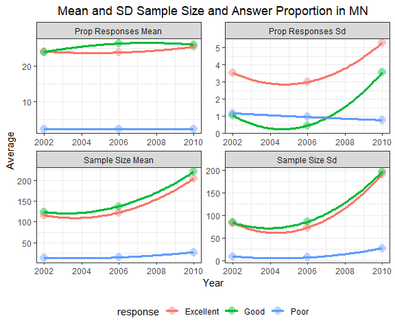

pubh_hw2_chri3744
================
Taylor Christian
2/7/2022

# Read smart data

``` r
smart.df <- read_csv("./data/brfss_smart_2010.csv", show_col_types = FALSE)
```

# 3.1 Data Cleaning

``` r
#Clean data and establish as factor or numeric
smart.df <- as_tibble(smart.df) %>%
  janitor::clean_names() %>%
  filter(topic == "Overall Health") %>%
  rename(state = locationabbr, prop_responses = data_value, county = locationdesc) %>%
  mutate(
    county = substring(county, 6),
    county = str_remove(county, " County"),
    year = year %>%
      as.character() %>%
      as.numeric(),
    state = as.factor(state),
    county = as.factor(county),
    response = as.factor(response),
    sample_size = as.numeric(sample_size),
    prop_responses = as.numeric(prop_responses)
  ) %>%
#Select relevant columns  
  select(year, state, county, response, sample_size, prop_responses)
```

# 3.2Data Description 

The number of observations is 10625 and the number of variables is 6.
Each observation represents a particular answer for the question “How is
your general health?” on a survey, such that one row is the information
for “excellent” answers for the question, in one location, in one year,
etc.  

## **Variables** 

**year:** the year in which the survey was taken.  
**state:** the abbreviated form of the state in which the survey was
taken.  
**county:** the county in which the survey was taken.  
**response:** the answer given to the question.  
**sample_size:** the number of responses yielded for that answer.  
**prop_responses:** the percentage of responses that yielded the given
answer. Unit: %  

## **General Info** 

In the case of our subset of this data, all observations included are
for the question topic “Overall Health,” which contains only a single
question: “How is your general health?” Additionally, while the
prop_responses variable is defined as the percentage of total answers,
determining the percentage by hand by adding all the answers for the
given year gives a different value. This could mean that some responses
are not included in these results, or that survey’s that had no answer
for that particular question may be used in determining the
prop_responses data.

# 3.3 Do Data Science 

## 3.3.1 States observed at 6 locations in 2004

``` r
smart.df %>%
  #Filter for 2004
  filter(year %in% 2004) %>%
  #Pull distinct county/state combinations
  distinct(county, state) %>%
  #Group by state
  group_by(state) %>%
  #Count number of counties per state
  summarise(distinct_counties = n()) %>%
  #Select for states w/ 6 counties observed
  filter(distinct_counties == 6)
```

    ## # A tibble: 8 x 2
    ##   state distinct_counties
    ##   <fct>             <int>
    ## 1 CO                    6
    ## 2 CT                    6
    ## 3 MD                    6
    ## 4 NM                    6
    ## 5 SC                    6
    ## 6 TX                    6
    ## 7 UT                    6
    ## 8 VT                    6

By observing the results of the logical statement above, we can see that
CO, CT, MD, NM, SC, TX, UT, and VT all have 6 locations that were
observed in 2004.

## 3.3.2 Spaghetti plot of observed locations from 2002 to 2010

``` r
smart.df %>%
  #Pull distinct state/county combinations for each year
  distinct(year, state, county) %>%
  #Group by year and state
  group_by(year, state) %>%
  #Count number of counties per state per year
  summarise(distinct_counties = n()) %>%
  #Order states by their mean number of distinct counties (seems to not be working?)
  mutate(
    State = fct_reorder(state, distinct_counties, .fun = mean, .desc = TRUE)
    ) %>%
  #Create our plot
  ggplot(aes(x = year, y = distinct_counties, color = State)) +
  geom_smooth(se = FALSE) +
  theme(legend.position = "right") +
  labs(x = "Distinct Counties",
      y = "Year",
      title = "Distinct Counties Per Year by State")
```



The state with the highest mean number of counties observed over the
period of 2002-2010 is PA. This can be determined by the ordering of the
legend, which sorts the highest mean counties per state to the top of
the list. Additionally, it is easy to observe that over time, the number
of distinct counties per state seems to be trending slightly upwards.
Even though a few lines can be seen dropping off in 2010, the overall
geometry of the plot seems to be increasing as time progresses.  

## 3.3.3 Table for 2002, 2006, 2010 mean and SD of sample size & proportion in MN

``` r
smart_table.df <- smart.df %>%
  #Select target years, target state, and target responses
  filter(year %in% c("2002", "2006", "2010"), state %in% "MN", response %in% c("Excellent", "Good", "Poor")) %>%
  #Group by year and response
  group_by(year, response) %>%
  #calculate our mean and SD of the target values
  summarise(across(contains(c("size","prop")),
            .fns = list(mean = mean, SD = sd),
            na.rm = TRUE,
            .names = "{.col}_{.fn}"
            ))
smart_table.df %>%
  #Create our table
  knitr::kable(col.names = c("Year", "Response", "Sample Size Mean", "Sample Size SD", "Prop Response Mean", "Prop Response SD"),
               caption = "Summary of Sample Size and Responses in MN")
```

| Year | Response  | Sample Size Mean | Sample Size SD | Prop Response Mean | Prop Response SD |
|-----:|:----------|-----------------:|---------------:|-------------------:|-----------------:|
| 2002 | Excellent |           116.00 |         83.275 |              24.15 |           3.5407 |
| 2002 | Good      |           123.75 |         84.263 |              23.95 |           1.0472 |
| 2002 | Poor      |            13.75 |          9.570 |               2.40 |           1.1690 |
| 2006 | Excellent |           122.33 |         72.625 |              23.83 |           2.9872 |
| 2006 | Good      |           137.33 |         85.816 |              26.37 |           0.4509 |
| 2006 | Poor      |            15.00 |          6.928 |               2.30 |           0.9539 |
| 2010 | Excellent |           203.80 |        190.598 |              25.44 |           5.2776 |
| 2010 | Good      |           220.00 |        196.100 |              26.04 |           3.5473 |
| 2010 | Poor      |            27.40 |         27.319 |               2.36 |           0.7701 |

Summary of Sample Size and Responses in MN

Upon a visual inspection of the data, it can be seen that the sample
size is trending upwards over time, while the proportion of each answer
doesn’t shift too much. The proportion of “Good” responses ticks upwards
slightly in 2006 and stays there, but otherwise changes are very minor
in the proportion means.

## 3.3.4 ggplot for the above table

``` r
smart_table.df %>%
  #Pivot longer to combine our values into one column
  pivot_longer(contains(c("mean","SD")), names_to = "category", values_to = "value") %>%
  #Clean up our category names
  mutate(
    category = str_replace_all(category, "_", " "),
    category = str_to_title(category)) %>%
  #Generate our plot
  ggplot(aes(year, value, colour = response)) +
  geom_point(size = 4, alpha = 0.44, shape = 16) +
  stat_smooth(alpha = 0.1, 
              size = 1.2, 
              method = "loess",
              span = 2,
              se = FALSE) +
  labs(x = "Year",
       y = "Average",
       title = "Mean and SD Sample Size and Answer Proportion in MN") +
  #Split our plot by category for better visualization
  facet_wrap(~category, scales = "free")
```


